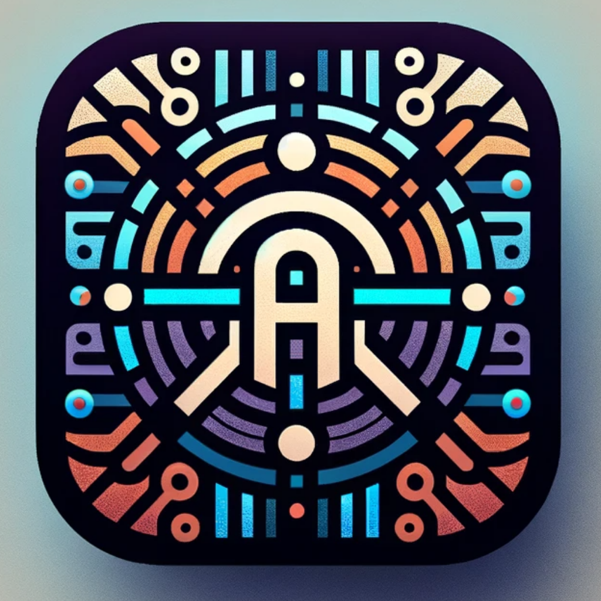
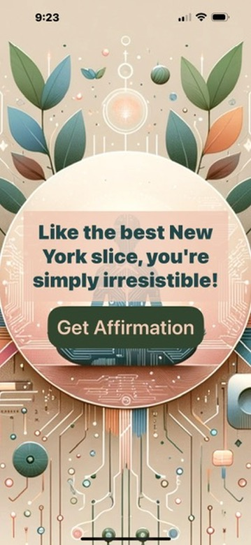

# AyaAffirmations

## Description

AyaAffirmations is a simple iOS app built using SwiftUI that provides users with a daily dose of positivity and self-affirmation. This app offers a collection of 100 unique affirmations carefully crafted to inspire and empower individuals to start their day with a positive mindset. Users can open the app anytime to receive a random affirmation and boost their confidence, motivation, and overall well-being. 

**Totally just a lab app. Not too much effort went into this**

## Features

- **Random Affirmations:** Receive a random affirmation for daily inspiration.
- **Beautiful UI:** User-friendly SwiftUI interface with customizable design options.

## Installation

1. Clone this repository to your local machine.
2. Open the project in Xcode.
3. Build and run the app on your iOS device or simulator.

## Usage

- Open the app. 
- Press the "Get Affirmation" button to view a random affirmation.

## Contributing

Contributions are welcome! If you have ideas for new features or improvements, please submit an issue or a pull request.

## License

This project is licensed under the MIT License - see the [LICENSE](LICENSE) file for details.

## Acknowledgments

- Special thanks to the open-source community for their contributions and support.

## Contact

- [GitHub](https://github.com/jamesmuldrow)
- LinkedIn: https://www.linkedin.com/in/jamesmuldrow/

## Screenshots

